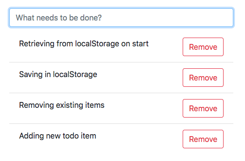

# Project-5

Create a simple todo app in javascript which keeps its data in Local Storage.

## Requirements

Needed features:

* Adding/removing entries.
* Confirmation on removing.
* Keeping data in local storage.
* Retrieving data from storage on start.

Desired app look:

