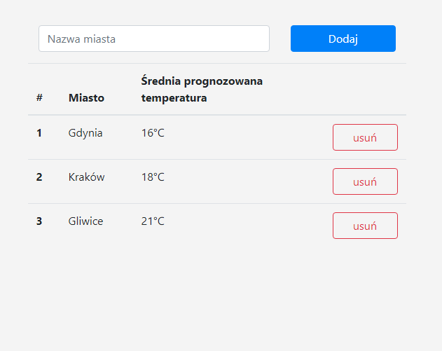

# Project-6

Create a single-page application displaying average forecast temperature for the next five days for selected cities.

## Requirements

Needed features:

* Adding/removing city entries.
* Keeping list of cities in local storage.
* Retrieving list from storage on start.

Technical:

* Use ES6 (ES6 modules and other).
* App should be an NPM package.
* Use Webpack.
* Split JS code across files/modules according to responsibility.
* Lock and gray out buttons during API calls.

App mock-up:

